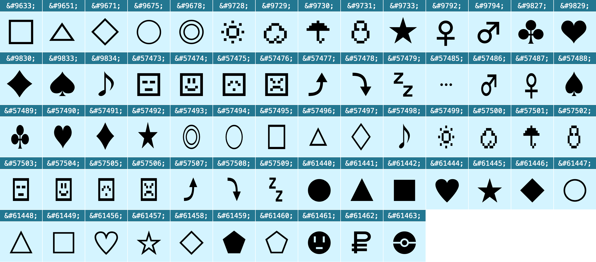
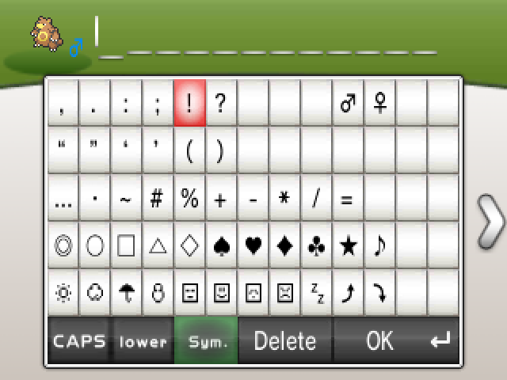
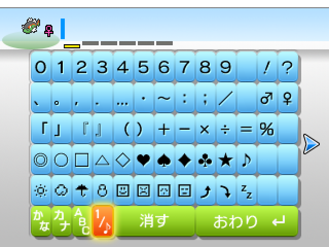

 

# PokéDings

This is a TTF font and SVG collection of all special characters that are usable in Pokémon nicknames up to Gen 7. They partly overlap with regular Unicode dingbats (U+25A1–U+266A), and all unique characters are in the [Private Use Area](https://en.wikipedia.org/wiki/Private_Use_Areas) of the [Basic Multilingual Plane](https://en.wikipedia.org/wiki/Plane_(Unicode)#Basic_Multilingual_Plane), and so are guaranteed never to conflict with future Unicode characters.

See [the specimen page](https://msikma.github.io/pokedings/assets/specimen.html) for an overview of all icons.

## Characters

The following characters are included:

Most of the character vectors were originally taken from the Pokémon Global Link website, but are no longer online today.

Several characters are original and were created to help with developing UIs:

* Pentagon (outline)
* Pentagon (solid)
* Pokérus Cured
* Pokémon Dollar (modeled after [the Gen 6 sprite](https://bulbapedia.bulbagarden.net/wiki/File:Pok%C3%A9monDollar_VI.png))
* Poké Ball

These cannot be used in nicknames and can safely be ignored if they're not needed.

### SVG files

A collection of SVG images for the characters is available in the [assets/svg/](assets/svg/) directory.

## In the games

In-game, the characters look like this:

 

For Japanese, the full-width characters should be used. This means that, for example, the smiley face character should map to U+E0A0 for English Pokémon, and to U+E082 for Japanese Pokémon.

## Related projects

* [PokéSprite](https://github.com/msikma/pokesprite) – Pokémon sprite database
* [PokéResources](https://github.com/msikma/pokeresources) – Various Pokémon image resources

## License

[MIT license](http://opensource.org/licenses/MIT)
